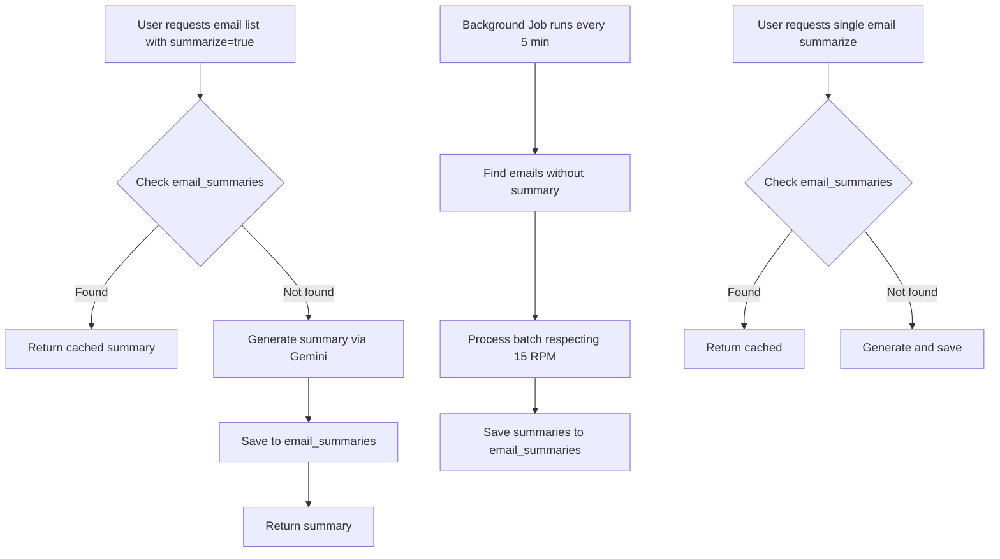

<!-- 9e4e57b8-f2a7-46a4-864d-b5fedbb064ab a4b35e1f-fe39-434e-8284-a8df28bb4e13 -->
# Email Summary Caching and Background Job Implementation

## Overview

Implement persistent summary storage and background job to automatically summarize emails, avoiding redundant API calls and respecting Gemini 2.5 Flash rate limits (15 RPM).

## Architecture Changes

### Database Schema

- **New collection**: `email_summaries`
  - Fields: `user_id`, `message_id`, `summary`, `created_at`, `updated_at`
  - Indexes: `(user_id, message_id)` unique, `(user_id, created_at)`

### Background Job

- **New job**: `run_summarize_job()` in `main.py`
  - Interval: Configurable via `SUMMARIZE_JOB_INTERVAL_MINUTES` (default: 5 minutes)
  - Rate limiting: Max 15 requests per minute (respecting Gemini free tier)
  - Scope: Emails within 30 days, newest first
  - Batch processing: Process in chunks to respect rate limits

## Backend Changes

### 1. Database Models & Indexes

**File**: `apps/server/app/main.py`

- Add index creation for `email_summaries` collection in `ensure_indexes()`

### 2. Configuration

**File**: `apps/server/app/config.py`

- Add `SUMMARIZE_JOB_INTERVAL_MINUTES: int = 5`
- Add `SUMMARIZE_LOOKBACK_DAYS: int = 30`
- Add `GEMINI_RATE_LIMIT_RPM: int = 15`

### 3. Mail Service Updates

**File**: `apps/server/app/api/mail/service.py`

#### 3.1 Add summary collection

- Initialize `self.email_summaries_collection = self.db["email_summaries"] `in `__init__`

#### 3.2 Update `summarize_email()` method

- Check `email_summaries` collection first before calling API
- Save summary to `email_summaries` after successful generation
- Return cached summary if exists

#### 3.3 Update `get_emails()` method

- When `summarize=True`, check `email_summaries` collection for cached summaries
- Only call API for emails without cached summaries
- Batch fetch summaries from DB for multiple emails

#### 3.4 Update `get_email_detail()` method

- When `summarize=True`, check `email_summaries` collection first
- Use cached summary if available

#### 3.5 New method: `process_summarize_queue()`

- Find emails in `email_index` that:
  - Are within `SUMMARIZE_LOOKBACK_DAYS` days
  - Don't have entries in `email_summaries`
  - Ordered by `received_on` DESC (newest first)
- Process in batches respecting 15 RPM limit
- Save summaries to `email_summaries` collection
- Handle errors gracefully (log and continue)

### 4. Background Job

**File**: `apps/server/app/main.py`

- Add `run_summarize_job()` function (similar to `run_embedding_job()`)
- Register job in `on_startup()` with configurable interval
- Use rate limiting logic to respect 15 RPM

### 5. Rate Limiting Utility

**File**: `apps/server/app/utils/rate_limiter.py` (new)

- Implement simple rate limiter class
- Track requests per minute
- Sleep/wait when limit is reached
- Thread-safe for async operations

## Frontend Changes

### 1. API Client Updates

**File**: `apps/client/src/api/mail.ts`

- No changes needed - existing `summarize` query param and `summarizeEmail()` function will work
- Backend will automatically use cached summaries

### 2. UI Enhancements (Optional)

- Show loading state when summary is being generated
- Show cached summary immediately when available
- Add indicator if summary is being generated in background

## Data Flow

## Implementation Steps

1. **Database**: Add `email_summaries` collection and indexes
2. **Config**: Add summarize job configuration
3. **Rate Limiter**: Create utility for rate limiting
4. **Service**: Update summarize methods to check cache first
5. **Background Job**: Implement `process_summarize_queue()` and register job
6. **Testing**: Verify caching works and job respects rate limits

## Rate Limiting Strategy

- **15 RPM limit**: Process max 15 emails per minute
- **Batch size**: Process 15 emails, then wait 60 seconds
- **Job interval**: Run every 5 minutes, process up to 75 emails per run (15 × 5)
- **Error handling**: Skip failed summaries, log errors, continue with next batch

## Migration Notes

- Existing summaries: None (fresh start)
- Backward compatibility: API endpoints remain the same
- Performance: First request may be slow, subsequent requests use cache