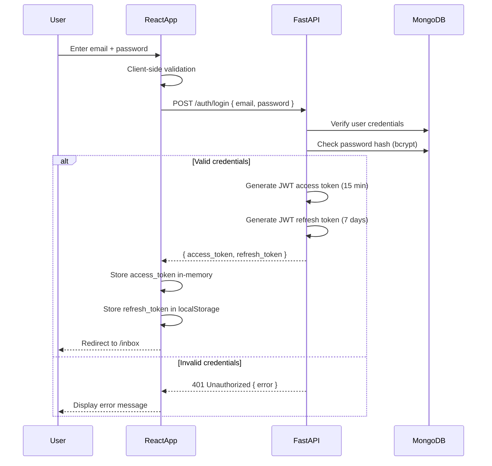
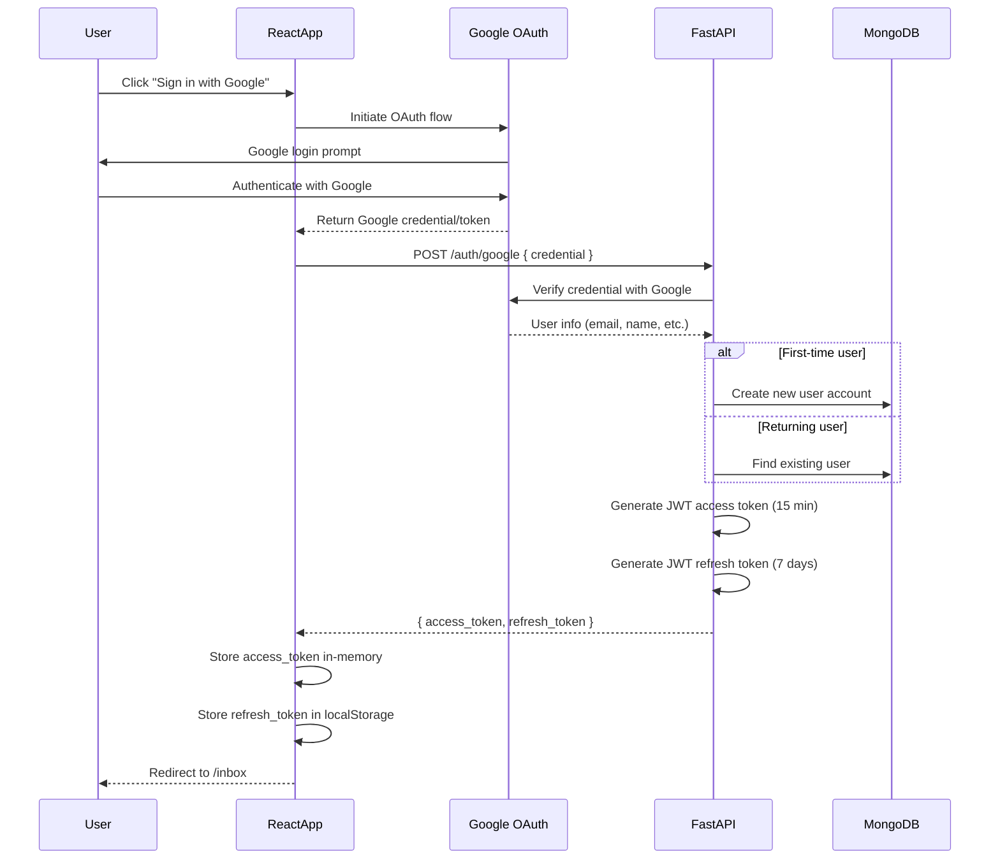
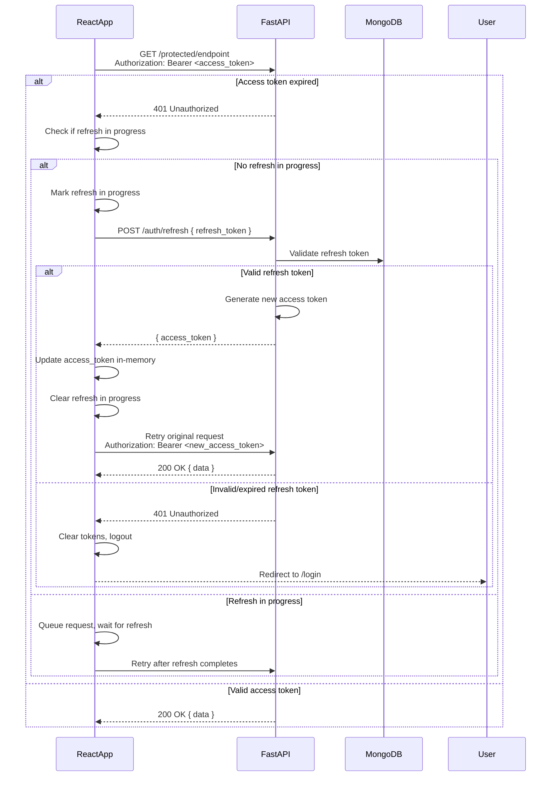

# Auth Sequence — Email/Password + Google Sign-In

## Email/Password Login Flow

## Google Sign-In OAuth Flow

## Token Refresh Flow

> Magic-link authentication documented for future implementation.

