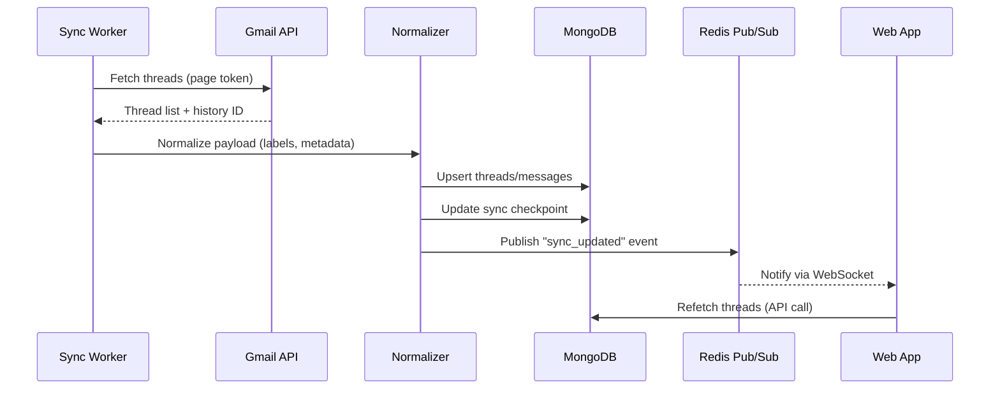

# Mail Sync Flow

```mermaid
sequenceDiagram
    participant Worker as Sync Worker
    participant Provider as Gmail API
    participant Normalizer as Normalizer
    participant Mongo as MongoDB
    participant Redis as Redis Pub/Sub
    participant WebApp as Web App

    Worker->>Provider: Fetch threads (page token)
    Provider-->>Worker: Thread list + history ID
    Worker->>Normalizer: Normalize payload (labels, metadata)
    Normalizer->>Mongo: Upsert threads/messages
    Normalizer->>Mongo: Update sync checkpoint
    Normalizer->>Redis: Publish "sync_updated" event
    Redis-->>WebApp: Notify via WebSocket
    WebApp->>Mongo: Refetch threads (API call)
```

> Ensure idempotency by storing Gmail history ID checkpoints per mailbox.

