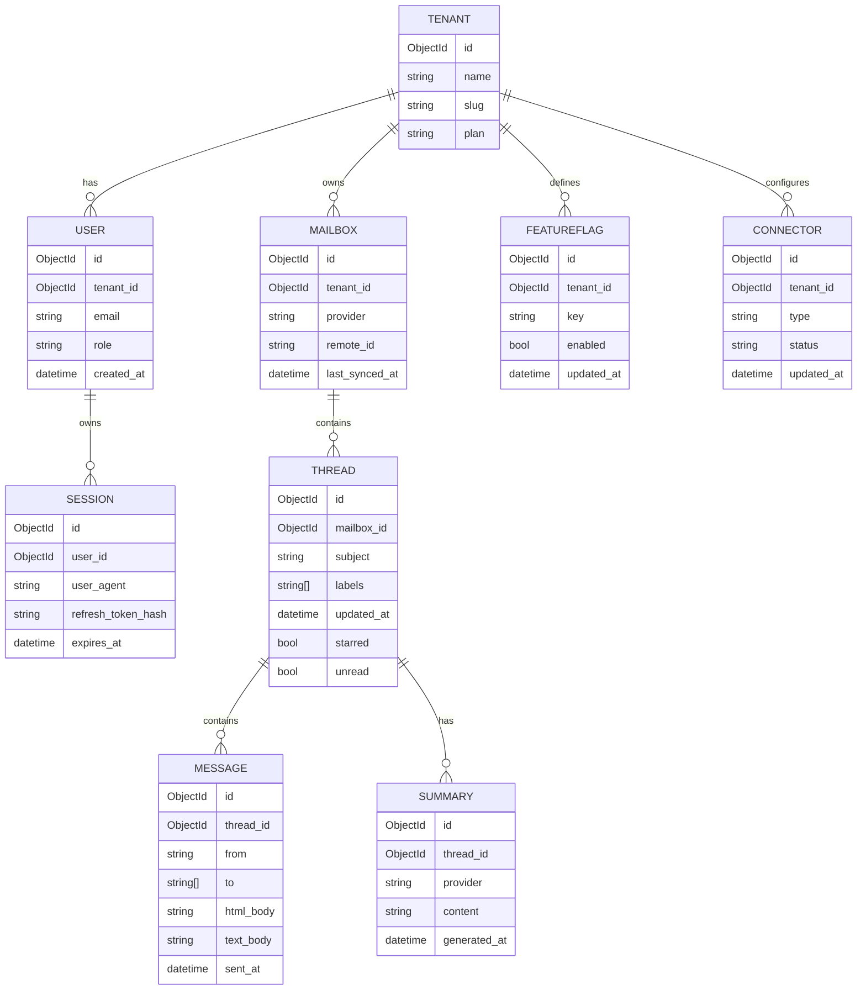

# Data Model Overview

Even though MongoDB is document-oriented, we model relationships explicitly to maintain clarity.

```mermaid
erDiagram
    TENANT ||--o{ USER : has
    TENANT ||--o{ MAILBOX : owns
    USER ||--o{ SESSION : owns
    MAILBOX ||--o{ THREAD : contains
    THREAD ||--o{ MESSAGE : contains
    THREAD ||--o{ SUMMARY : has
    TENANT ||--o{ FEATUREFLAG : defines
    TENANT ||--o{ CONNECTOR : configures

    TENANT {
        ObjectId id
        string name
        string slug
        string plan
    }
    USER {
        ObjectId id
        ObjectId tenant_id
        string email
        string role
        datetime created_at
    }
    SESSION {
        ObjectId id
        ObjectId user_id
        string user_agent
        string refresh_token_hash
        datetime expires_at
    }
    MAILBOX {
        ObjectId id
        ObjectId tenant_id
        string provider
        string remote_id
        datetime last_synced_at
    }
    THREAD {
        ObjectId id
        ObjectId mailbox_id
        string subject
        string[] labels
        datetime updated_at
        bool starred
        bool unread
    }
    MESSAGE {
        ObjectId id
        ObjectId thread_id
        string from
        string[] to
        string html_body
        string text_body
        datetime sent_at
    }
    SUMMARY {
        ObjectId id
        ObjectId thread_id
        string provider
        string content
        datetime generated_at
    }
    FEATUREFLAG {
        ObjectId id
        ObjectId tenant_id
        string key
        bool enabled
        datetime updated_at
    }
    CONNECTOR {
        ObjectId id
        ObjectId tenant_id
        string type
        string status
        datetime updated_at
    }
```

> Keep this diagram updated when Mongo collections evolve.

